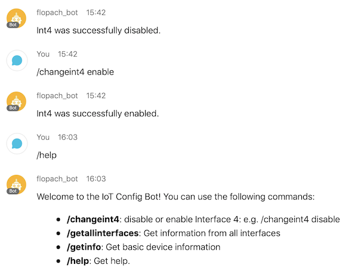

Simple Industrial Networking ChatOps Example with NETCONF and Cisco Webex
=====================================

This is a simple ChatOps example in the industrial networking space. It will show how easy it is to implement ChatOps with one simple script!

## Related Sandbox

[IR1101 DevNet Sandbox](https://devnetsandbox.cisco.com/RM/Diagram/Index/a2046279-a193-4d22-87b3-abcfee9569a6?diagramType=Topology)

## Links to DevNet Learning Labs

[Learning Labs: Industrial NetDevOps - Getting Started](https://developer.cisco.com/learning/modules/industrial-netdevops)